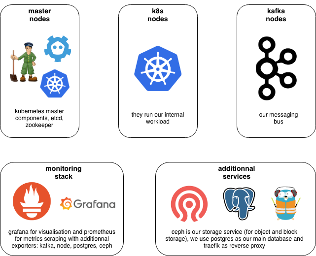

# infrastructure

### how it works



### variables

- EMAIL: email de contact
- DOMAIN: le nom de domaine
- GRAFANA_CLIENT_ID: le client id github pour l'auth grafana
- GRAFANA_CLIENT_SECRET: le client secret github pour l'auth grafana
- DRONE_CLIENT_ID: le client id github pour l'auth drone
- DRONE_CLIENT_SECRET: le client secret github pour l'auth drone

### terraform apply

```
cd ./terraform
terraform apply \
  -var "image=$IMAGE"                                                       \
  -var "domain=$DOMAIN"                                                     \
  -var "email=$EMAIL"                                                       \
  -var "datacenter=$DATACENTER"                                             \
  -var "encryption_key=$ENCRYPTION_KEY"                                     \
  -var "agent_token=$AGENT_TOKEN"                                           \
  -var "scaleway_discovery_organization=$SCALEWAY_DISCOVERY_ORGANIZATION"   \
  -var "scaleway_discovery_token=$SCALEWAY_DISCOVERY_TOKEN"                 \
  -var "scaleway_discovery_region=$SCALEWAY_DISCOVERY_REGION"               \
  -var "drone_client_id=$DRONE_CLIENT_ID"                                   \
  -var "drone_client_secret=$DRONE_CLIENT_SECRET"                           \
  -var "grafana_client_id=$GRAFANA_CLIENT_ID"                               \
  -var "grafana_client_secret=$GRAFANA_CLIENT_SECRET"
```

### terraform destroy

```
cd ./terraform
terraform destroy \
  -var "image=$IMAGE"                                                       \
  -var "domain=$DOMAIN"                                                     \
  -var "email=$EMAIL"                                                       \
  -var "datacenter=$DATACENTER"                                             \
  -var "encryption_key=$ENCRYPTION_KEY"                                     \
  -var "agent_token=$AGENT_TOKEN"                                           \
  -var "scaleway_discovery_organization=$SCALEWAY_DISCOVERY_ORGANIZATION"   \
  -var "scaleway_discovery_token=$SCALEWAY_DISCOVERY_TOKEN"                 \
  -var "scaleway_discovery_region=$SCALEWAY_DISCOVERY_REGION"               \
  -var "drone_client_id=$DRONE_CLIENT_ID"                                   \
  -var "drone_client_secret=$DRONE_CLIENT_SECRET"                           \
  -var "grafana_client_secret=$GRAFANA_CLIENT_ID"                           \
  -var "grafana_client_secret=$GRAFANA_CLIENT_SECRET"
```
